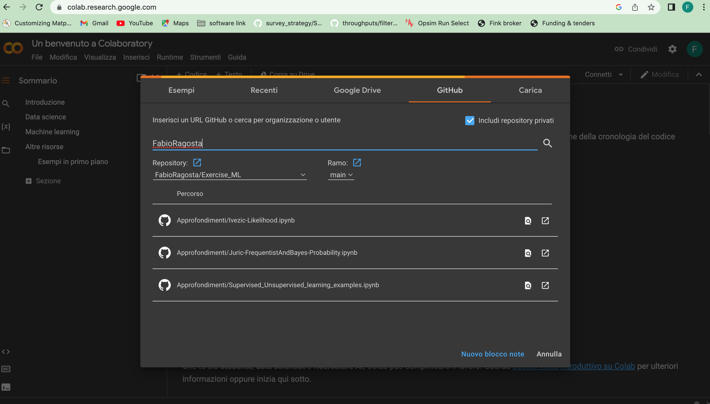

# Exercise_ML
Material for the machine learning course at OAR. All the notebooks are from different sources: 
* https://github.com/LSSTC-DSFP/LSSTC-DSFP-Sessions 
* https://github.com/JWarmenhoven/Coursera-Machine-Learning/tree/master/notebooks

Below there are instructions for the standard install of Python > 3.7 for the course.

* Download the appropriate version of miniconda for your computing environment: https://conda.io/miniconda.html
* Follow the "quick install" instructions to install miniconda on your machine: https://conda.io/docs/install/quick.html
* Once you have installed miniconda, we need to set up a conda environment for our work. (To learn more about conda virtual environments, consult their docs: https://conda.io/docs/using/envs.html) From the command line (note this is slightly different on a Windows machine), enter the following: **conda env create -f environment.yml**
* To activate the environment, this should be done prior to any work at the DSFP, enter the following on the command line:  **conda activate OAR_ML_env**
* To exit the environment, type the following: **conda deactivate**

If you don't want to install Anaconda or python on your pc, you still can work on the notebooks:
* go on google colab and log with your google account
* open the Github option and set the connection with this repository (see the picture) : 

## Python Tutorial

If you are very new with python, please use these tutorials before the course: 

* https://jckantor.github.io/CBE30338/01.01-Getting-Started-with-Python-and-Jupyter-Notebooks.html
* https://github.com/milaan9/01_Python_Introduction
